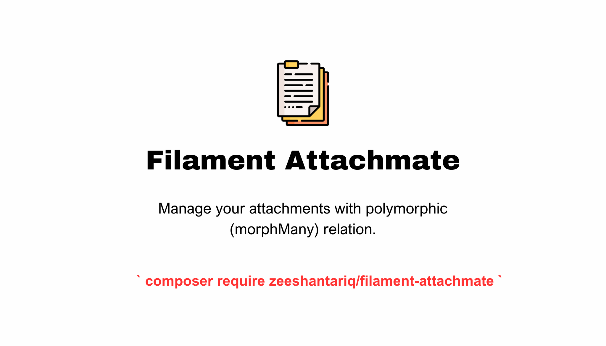

# Filament Attachmate

This package provides attachment management using a polymorphic morphMany relationship within Filament. The system allows for the seamless association of attachments with various models, enabling flexible and efficient handling of file attachments across your application.




## Installation

You can install the package via composer:

```bash
composer require zeeshantariq/filament-attachmate
```

The package comes with publishable assets:

**Migrations**
```bash
php artisan vendor:publish --tag="filament-attachmate-migrations"
```

## Quick start
Please read the following steps to understand how to use this package.
[Quick start steps](QUICKSTART.md)

## Changelog

Please see [CHANGELOG](CHANGELOG.md) for more information on what has changed recently.

## Contributing

Please see [CONTRIBUTING](.github/CONTRIBUTING.md) for details.

## Security Vulnerabilities

Please review [our security policy](zeeshantariq08/filament-attachmate/security/policy) on how to report security vulnerabilities.

## Credits

- [zeeshan](https://github.com/zeeshantariq08)

## License

The MIT License (MIT). Please see [License File](LICENSE.md) for more information.
